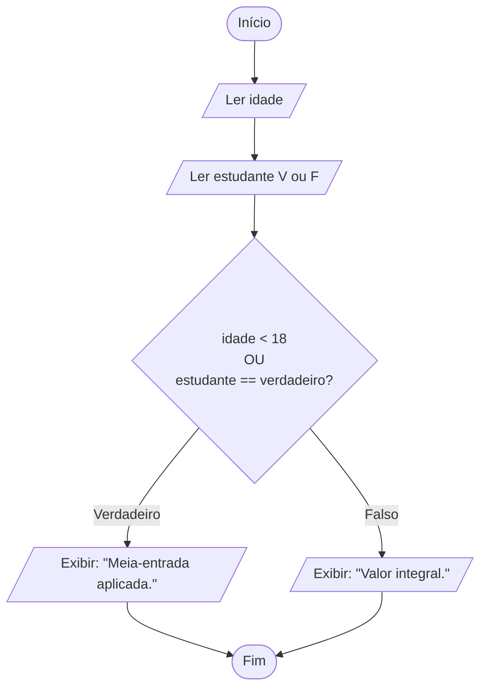

# Desafio: Verificação de desconto (meia-entrada)

## Regra de negócio

O cliente tem direito à **meia-entrada** se **qualquer uma** destas condições for verdadeira:

- Tem menos de 18 anos, **ou**
- É estudante

Basta uma das duas ser verdadeira (operador lógico **OU**).

---

## Algoritmo em linguagem natural

1. Solicitar a **idade** do cliente.
2. Perguntar se o cliente **é estudante** (verdadeiro ou falso).
3. Avaliar a expressão lógica: `idade < 18 OU estudante == verdadeiro`.
4. Se a expressão for **verdadeira**, exibir: `"Meia-entrada aplicada."`
5. Caso contrário, exibir: `"Valor integral."`

---

## Pseudocódigo (estilo Portugol)

```
algoritmo "VerificacaoDesconto"
var
    idade: inteiro
    estudante: logico
inicio
    escreva("Informe a idade do cliente: ")
    leia(idade)

    escreva("O cliente e estudante (V/F)? ")
    leia(estudante)

    se (idade < 18) ou (estudante = verdadeiro) entao
        escreval("Meia-entrada aplicada.")
    senao
        escreval("Valor integral.")
    fimse
fimalgoritmo
```

---

## Fluxograma



---

## Tabela de teste (todos os cenários)

| idade | estudante | idade < 18 | Resultado                |
|-------|-----------|------------|--------------------------|
| 15    | falso     | V          | Meia-entrada aplicada.   |
| 15    | verdadeiro| V          | Meia-entrada aplicada.   |
| 25    | verdadeiro| F          | Meia-entrada aplicada.   |
| 25    | falso     | F          | Valor integral.          |
| 18    | falso     | F          | Valor integral.          |
| 17    | falso     | V          | Meia-entrada aplicada.   |

Observação: aos **18 anos exatos** a condição `idade < 18` é falsa, então só há
desconto se o cliente for estudante.
